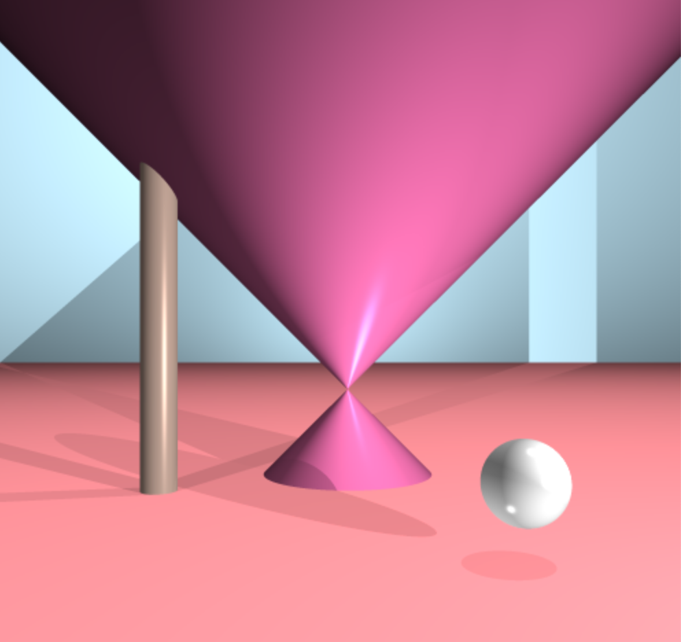

# Ray Tracer
This project implements a raytracing, which is one of the approaches to rendering 3D computer-generated images. This raytracer could generate four geometric elements—sphere, cone, cylinder, and plane— with supported features including shadows and anti-aliasing(supersampling).



This project is written in C and uses the graphic library [miniLibX](minilibx_macos). Developed by Olivier Crouzet, miniLibX library allows users to open a window, light a pixel, and deal with keyboard and mouse.

_Note_: The miniLibX library used in this repository is made for MacOS. In order to use it on Linux, please refer to [here](https://github.com/42Paris/minilibx-linux).

## How to run the program
1. [Clone](https://help.github.com/articles/cloning-a-repository/) the repository onto your local computer.
```
git clone https://github.com/mjaything/raytracer.git
```

2. Navigate into the cloned repository.
```
cd raytracer
```

3. Run [make](https://www.gnu.org/software/make/manual/make.html).
```
make
```

4. Run the executable with a scene file, and specify camera angles on x, y, z axes. Scene files are located in the [scenes directory](https://github.com/mjaything/raytracer/tree/master/scenes).
```
./raytracer SCENE_FILE -x [angle(degree)] -y [angle(degree)] -z [angle(degree)]
```

## Example Usage
```
./raytracer scenes/multi-object -x 0 -y 0 -z 0
```

## Reference
Buck, Jamis (2019). *The Ray Tracer Challenge*. Pragmatic Bookshelf.
